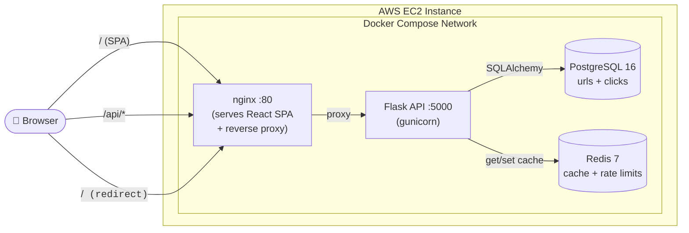
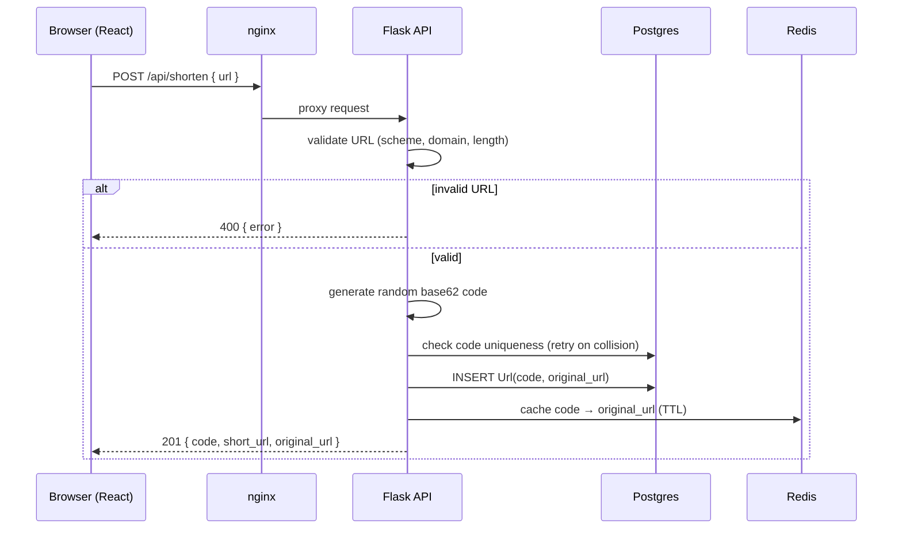
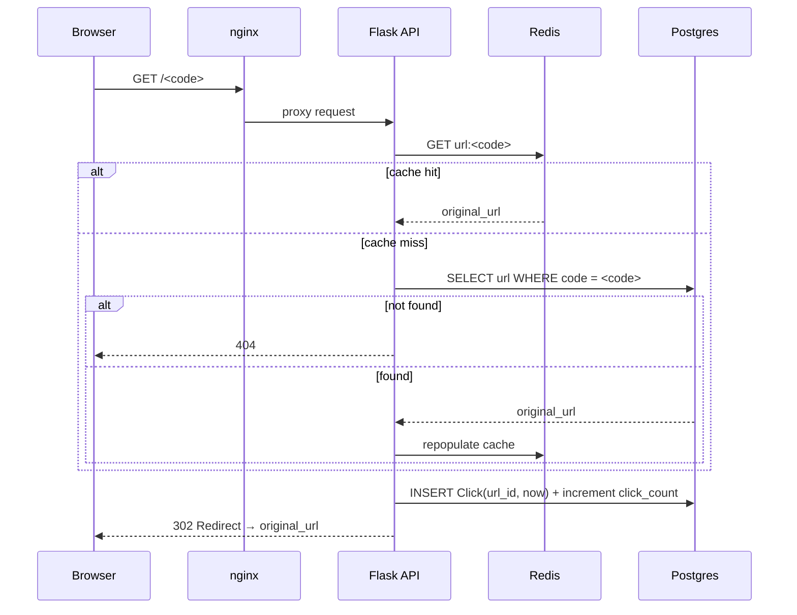
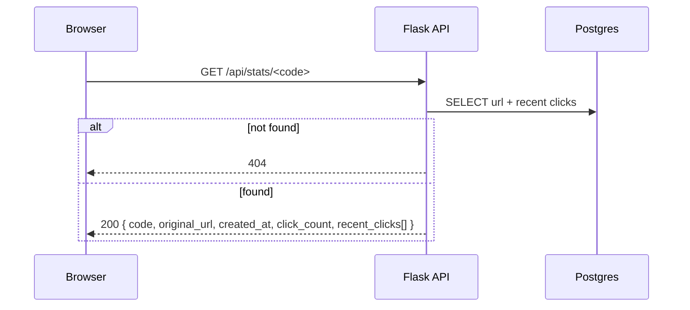
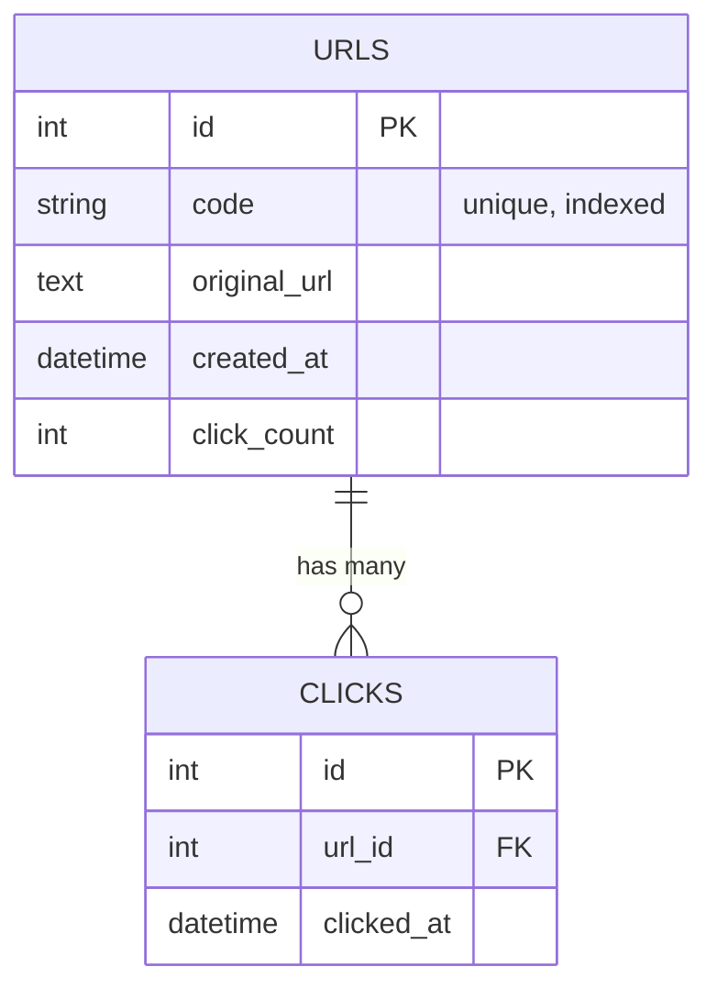
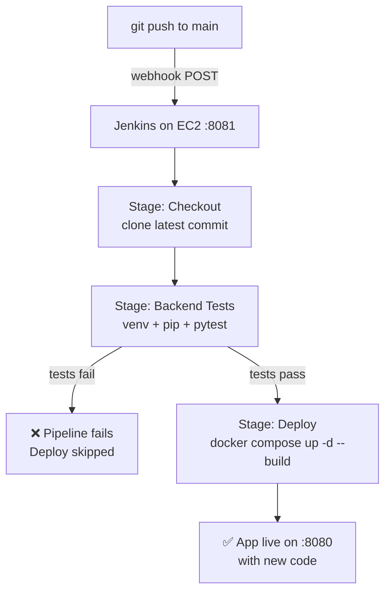
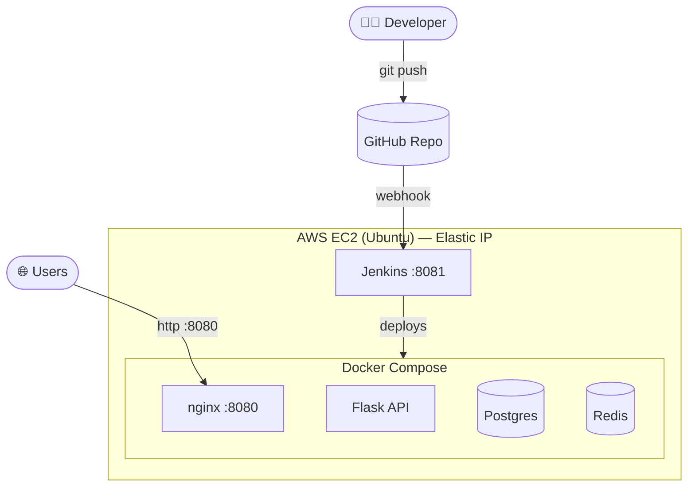

# 🔗 URL Shortener — Full-Stack App with CI/CD on AWS

A production-style URL shortener (like bit.ly): paste a long URL, get a short code, and track click analytics. Built as a fully containerized full-stack application and deployed on AWS EC2 with an automated **CI/CD pipeline** (Jenkins + GitHub webhooks) that tests and redeploys on every push.

> **What makes this more than a tutorial project:** it's not just code — it's the whole delivery chain. Flask + Postgres + Redis behind an nginx-served React SPA, packaged with Docker Compose, deployed to AWS, and wired to a Jenkins pipeline that runs the test suite and auto-deploys only when tests pass.

---

## 📑 Table of Contents

- [Features](#-features)
- [Tech Stack](#-tech-stack)
- [System Architecture](#-system-architecture)
- [Repository Structure](#-repository-structure)
- [Low-Level Design — Request Flows](#-low-level-design--request-flows)
- [Data Model](#-data-model)
- [Backend Deep-Dive](#-backend-deep-dive)
- [API Reference](#-api-reference)
- [CI/CD Pipeline](#-cicd-pipeline)
- [AWS Deployment Architecture](#-aws-deployment-architecture)
- [Running Locally](#-running-locally)
- [Configuration](#-configuration)
- [Engineering Challenges & Solutions](#-engineering-challenges--solutions)
- [Skills Demonstrated](#-skills-demonstrated)
- [Future Improvements](#-future-improvements)

---

## ✨ Features

- **Shorten any URL** into a compact, non-guessable random base62 code.
- **Fast redirects** backed by a Redis cache, with Postgres as the source of truth.
- **Click analytics** — every redirect is recorded with a timestamp; total counts and recent clicks are queryable.
- **Input validation** — only valid `http`/`https` URLs are accepted; a missing scheme defaults to `https`.
- **Rate limiting** — the shorten endpoint is throttled per-IP (Redis-backed) to prevent abuse.
- **Single-command local run** — `docker compose up` brings up the entire stack.
- **Automated CI/CD** — push to GitHub → tests run → app redeploys automatically.

---

## 🧰 Tech Stack

| Layer            | Technology                                             |
| ---------------- | ------------------------------------------------------ |
| **Frontend**     | React 18 + Vite, served as static files by **nginx**   |
| **Backend**      | Python **Flask** (app factory pattern), **gunicorn**   |
| **ORM**          | SQLAlchemy + Flask-SQLAlchemy                          |
| **Database**     | **PostgreSQL 16** (URL mappings + click events)        |
| **Cache**        | **Redis 7** (redirect cache + rate-limit counters)     |
| **Rate limiting**| Flask-Limiter (Redis storage backend)                  |
| **Reverse proxy**| nginx (serves SPA + proxies API/redirect routes)       |
| **Containerization** | Docker + Docker Compose                            |
| **CI/CD**        | **Jenkins** (declarative pipeline) + GitHub webhooks   |
| **Cloud**        | **AWS EC2** (Ubuntu) + Elastic IP                      |
| **Testing**      | pytest (SQLite-backed, no external services needed)    |

---

## 🏛 System Architecture

Everything runs behind a single origin: nginx serves the React app and reverse-proxies API calls and short-code redirects to Flask. Flask talks to Postgres for persistence and Redis for caching and rate limiting.



**Routing rules inside nginx:**

| Incoming path        | Handled by                          |
| -------------------- | ----------------------------------- |
| `/`, static assets   | React SPA (static files)            |
| `/api/*`             | Proxied to Flask                    |
| `/<code>` (5–12 chars)| Proxied to Flask (302 redirect)    |
| `/health`            | Proxied to Flask (health check)     |

---

## 📂 Repository Structure

```
url-shortener/
├── docker-compose.yml          # Orchestrates api + frontend + postgres + redis
├── .env.example                # Environment variable template
├── Jenkinsfile                 # CI/CD pipeline (test → deploy)
├── README.md
│
├── backend/
│   ├── Dockerfile              # gunicorn app image (--preload)
│   ├── requirements.txt        # Runtime dependencies
│   ├── requirements-test.txt   # Test-only deps (no psycopg2/gunicorn)
│   ├── pytest.ini              # Adds backend/ to sys.path for imports
│   ├── wsgi.py                 # gunicorn entrypoint
│   ├── app/
│   │   ├── __init__.py         # App factory + extension wiring
│   │   ├── config.py           # Env-driven configuration
│   │   ├── models.py           # Url + Click SQLAlchemy models
│   │   ├── routes.py           # shorten / redirect / stats / health
│   │   ├── shortener.py        # Random base62 code generation + retry
│   │   ├── cache.py            # Redis helpers (graceful degradation)
│   │   └── validators.py       # URL validation
│   └── tests/
│       ├── conftest.py         # Test fixtures (SQLite, in-memory limiter)
│       └── test_api.py         # End-to-end API tests
│
└── frontend/
    ├── Dockerfile              # Multi-stage: Vite build → nginx serve
    ├── nginx.conf              # SPA + reverse-proxy config
    ├── package.json
    ├── vite.config.js
    ├── index.html
    └── src/
        ├── main.jsx
        ├── App.jsx             # UI: shorten, copy, view stats
        ├── api.js              # fetch wrappers
        └── styles.css
```

---

## 🔬 Low-Level Design — Request Flows

### 1. Shortening a URL

When a user submits a URL, the backend validates it, generates a unique random code, persists it, warms the cache, and returns the short link.



### 2. Redirecting a short link (the hot path)

Redirects are performance-critical, so they check Redis first and only fall back to Postgres on a cache miss. Each redirect also records a timestamped click.



### 3. Viewing analytics



---

## 🗃 Data Model



- **`urls`** stores the mapping. `code` is unique and indexed for fast lookups. `click_count` is a denormalized counter for O(1) reads on the stats endpoint.
- **`clicks`** stores one timestamped row per redirect, enabling time-series analytics (e.g. recent-clicks list, future charts).

---

## 🧠 Backend Deep-Dive

**App factory (`app/__init__.py`)** — Flask is created via a factory function so the same app can be configured differently for production vs. tests. Extensions (SQLAlchemy, Flask-Limiter) are initialized here, and the schema is created on boot.

**Short-code generation (`shortener.py`)** — Codes are random base62 strings (`a–z A–Z 0–9`), 6 characters by default (~56 billion combinations). A uniqueness check retries on the rare collision, and the length grows automatically after repeated collisions so the scheme stays robust as the table fills. Random (not sequential) codes make links non-enumerable.

**Caching (`cache.py`)** — A thin Redis wrapper for `code → original_url`. Crucially, **all Redis errors are swallowed**: if the cache is unavailable, redirects transparently fall back to Postgres. The cache is a performance optimization, never a hard dependency.

**Rate limiting** — Flask-Limiter with a Redis storage backend. The shorten endpoint is capped per-IP (default `10/min`); other routes get a generous default. Limits are configurable via environment variables.

**Validation (`validators.py`)** — Enforces `http`/`https` scheme (defaulting to `https` if omitted), a plausible domain, and a max length, rejecting malformed input before it ever hits the database.

**Concurrency-safe startup** — gunicorn runs with `--preload` so `db.create_all()` executes **once** in the master process before workers fork, avoiding a schema-creation race between workers (a bug that surfaced and was fixed during development — see [Challenges](#-engineering-challenges--solutions)).

---

## 🔌 API Reference

| Method | Endpoint            | Description                                                       | Success | Errors |
| ------ | ------------------- | ---------------------------------------------------------------- | ------- | ------ |
| `POST` | `/api/shorten`      | Body `{ "url": "..." }` → creates a short code. Rate-limited.     | `201`   | `400`, `429` |
| `GET`  | `/<code>`           | Redirects to the original URL and records a click.               | `302`   | `404`  |
| `GET`  | `/api/stats/<code>` | Returns analytics for a code.                                    | `200`   | `404`  |
| `GET`  | `/health`           | Liveness check.                                                  | `200`   | —      |

**Example**

```bash
# Create a short link
curl -X POST http://<host>:8080/api/shorten \
  -H "Content-Type: application/json" \
  -d '{"url": "https://example.com/some/really/long/path"}'
# → { "code": "aZ3k9Q", "short_url": "http://<host>:8080/aZ3k9Q", "original_url": "..." }

# Follow it (302 redirect, records a click)
curl -i http://<host>:8080/aZ3k9Q

# View analytics
curl http://<host>:8080/api/stats/aZ3k9Q
# → { "code": "aZ3k9Q", "original_url": "...", "created_at": "...",
#     "click_count": 1, "recent_clicks": ["..."] }
```

---

## 🚀 CI/CD Pipeline

Every push to `main` triggers a GitHub webhook that pokes Jenkins (running on the same EC2 instance). Jenkins checks out the code, runs the test suite, and **only if tests pass**, rebuilds and redeploys the containers.



**Pipeline stages (`Jenkinsfile`):**

1. **Checkout** — Jenkins clones the exact pushed commit into its workspace.
2. **Backend Tests** — creates a Python virtualenv, installs *test-only* dependencies (`requirements-test.txt`), and runs `pytest`. The suite uses SQLite and an in-memory rate limiter, so **no Postgres or Redis is needed to test** — it's fast and hermetic. Results are published as JUnit reports.
3. **Deploy** — runs `docker compose up -d --build`, rebuilding images from the fresh code and recreating changed containers. Because a failed stage aborts the run, **broken code never reaches deploy**.

**Why the test stage is Postgres/Redis-free:** the app is written so its cache and rate limiter degrade gracefully and the ORM works against SQLite, letting CI validate real behavior without spinning up external services — a deliberate design choice that keeps the pipeline lightweight.

**Gating merges (optional next step):** pairing this with GitHub branch-protection "required status checks" would block merges into `main` when tests fail — turning Jenkins from an alarm into a hard gate.

---

## ☁️ AWS Deployment Architecture



- A single EC2 instance hosts both **Jenkins** (port 8081) and the **app** (port 8080) — separated by port and secured via the instance's security group.
- An **Elastic IP** gives the app a stable public address that survives instance stop/start, so short links and the webhook URL never break.
- The security group exposes only what's needed: SSH (22), app (8080), and Jenkins (8081).

---

## 💻 Running Locally

Prerequisites: Docker + Docker Compose.

```bash
git clone https://github.com/surya3285/url-shortener.git
cd url-shortener
cp .env.example .env          # optional; sensible defaults are built in
docker compose up --build
```

Open **http://localhost:8080**. That one command starts four containers (postgres, redis, api, frontend); the database schema is created automatically on first boot.

**Backend tests** (no Docker needed):

```bash
cd backend
python3 -m venv .venv && . .venv/bin/activate
pip install -r requirements-test.txt
pytest
```

---

## ⚙️ Configuration

All settings have sensible defaults and can be overridden via `.env`:

| Variable             | Default                     | Purpose                                       |
| -------------------- | --------------------------- | --------------------------------------------- |
| `APP_PORT`           | `8080`                      | Host port the app is served on                |
| `BASE_URL`           | `http://localhost:8080`     | Base used to build returned short links       |
| `POSTGRES_USER/PASSWORD/DB` | `postgres` / `postgres` / `urlshortener` | Database credentials     |
| `SECRET_KEY`         | `dev-secret-change-me`      | Flask secret key                              |
| `CODE_LENGTH`        | `6`                         | Length of generated short codes               |
| `CACHE_TTL`          | `3600`                      | Redis cache TTL (seconds)                     |
| `SHORTEN_RATE_LIMIT` | `10 per minute`             | Per-IP limit on the shorten endpoint          |

---

## 🧗 Engineering Challenges & Solutions

Real deployment surfaced real problems. A sample of what was diagnosed and fixed:

| Challenge | Root Cause | Solution |
| --------- | ---------- | -------- |
| **API crash-looping on boot** | Two gunicorn workers ran `db.create_all()` concurrently against a fresh DB, racing on Postgres's system catalog (`duplicate key ... urls_id_seq`). | Added gunicorn `--preload` so the schema is created once in the master before forking, plus an `IntegrityError` guard as a safety net. |
| **Port conflict on the instance** | Jenkins and the app both defaulted to port 8080. | Moved Jenkins to 8081 via a systemd drop-in override; kept the app on 8080. |
| **Jenkins node going offline** | Small instance ran out of disk and `/tmp` (tmpfs) space; later, RAM exhaustion (no swap) caused thrashing. | Repointed Jenkins' temp dir to disk, added a swap file, and ultimately **right-sized the instance** (more RAM + disk). |
| **CI failing on `psycopg2` build** | The Postgres driver has no prebuilt wheel for the host's newer Python, so pip tried to compile from source (missing `pg_config`). | Split out a `requirements-test.txt` with **only** what tests need — the suite uses SQLite, so the Postgres driver isn't required in CI. |
| **`ModuleNotFoundError: app` in CI** | Bare `pytest` (vs `python -m pytest`) doesn't add the working dir to `sys.path`. | Added `pytest.ini` with `pythonpath = .` so imports resolve regardless of invocation. |
| **Redirects fragile if cache down** | A hard Redis dependency would take down redirects. | Wrapped all cache calls to swallow Redis errors and fall back to Postgres. |

> This section is the real story of the project: the code was the easy part — making it **build, test, and deploy reliably in a real environment** is where the engineering happened.

---

## 🎯 Skills Demonstrated

- **Full-stack development** — REST API design, relational data modeling, and a React SPA.
- **Backend engineering** — Flask app-factory architecture, SQLAlchemy ORM, caching strategy, rate limiting, input validation.
- **Containerization** — multi-service Docker Compose, multi-stage builds, health checks, nginx reverse proxying.
- **CI/CD** — Jenkins declarative pipelines, GitHub webhooks, automated testing gates, continuous deployment.
- **Cloud & DevOps** — AWS EC2, Elastic IP, security groups, systemd, Linux troubleshooting (disk/memory/swap), production debugging.
- **Testing** — hermetic pytest suite designed to run without external dependencies.

---

## 🔭 Future Improvements

- **Branch protection + required checks** so failing tests block merges.
- **Zero-downtime deploys** (rolling update or blue-green) instead of restart-in-place.
- **HTTPS** via a domain + Let's Encrypt / an ALB.
- **Analytics dashboard** — charts of clicks over time using the `clicks` table.
- **Custom aliases** and link expiration.
- **Separate CI and hosting** onto different instances (or managed services) for isolation.

---

## 👤 Author

**Suryababu** — built end-to-end as a first full-stack + DevOps project: from empty repo to a live, auto-deployed application on AWS.

📦 Repository: [github.com/surya3285/url-shortener](https://github.com/surya3285/url-shortener)
